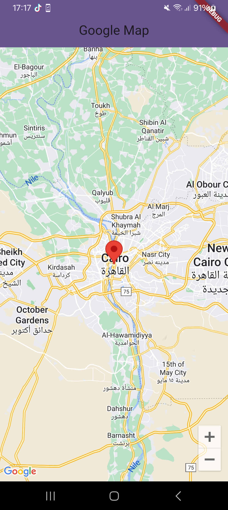

# 📌 Maps App

## 📷 **Overview**
This Flutter project displays a Google Map with an initial camera position centered on Cairo, Egypt. The app includes a single marker placed at Cairo's coordinates. The map is implemented using the `google_maps_flutter` package.

## 🚀 **Features**
- Displays Google Map with an initial position centered on Cairo.
- Adds a marker at Cairo's location.

## 🔧 **Dependencies**
- [google_maps_flutter](https://pub.dev/packages/google_maps_flutter) package.

## **Screenshots**
